<div align="center">



<br/><br/>

<a href="https://git.io/typing-svg">
  
</a>

<br/><br/>

<p>
  
  
  
</p>

<p>
  <a href="https://vivar.visox.tech/" target="_blank"></a>
  <a href="https://visox.tech/" target="_blank"></a>
  <a href="https://linkedin.com/in/miguel-vivar-farfan" target="_blank"></a>
  <a href="mailto:miguelvivarfarfan@gmail.com"></a>
</p>

</div>

<br/>

## ⚡ Quick facts

| | |
|---|---|
| 🎓 **Educación** | Ingeniería de Sistemas — UNICA (Ica, Perú) · Tercio Superior |
| 🏛️ **CEO & Tech Lead** | [LicitaYa](https://vivar.visox.tech/) — SaaS B2B de automatización para SEACE |
| ⚙️ **Co-Founder & Tech Lead** | Visox — consultoría de software e ingeniería de sistemas |
| 🧩 **Consultor ERP** | Corporación Inocua — Odoo 18 Enterprise (CRM, Ventas, Compras) |
| 🤖 **Software Developer** | ASU Digital S.A.C. — pipelines de IA Generativa / MinIO / K8s |
| 🌐 **Organizer** | GDG Ica — Google Developer Groups |
| 📜 **Certificaciones** | AWS Certified · DeepTech Bootcamp (individual, top score) |

<br/>

<div align="center">


<sub>Métricas agregadas de los proyectos entregados vía Visox</sub>

</div>

<br/>

```typescript
interface TechLeader {
  readonly name: string;
  location: string;
  education: string;
  roles: Role[];
  currentSprint: string[];
  stack: TechStack;
}

interface Role {
  title: string;
  org: string;
  since: `${number}-${number}`;
}

type TechStack = Record<
  "languages" | "frontend" | "backend" | "data" | "cloud" | "ai",
  string[]
>;

const miguel: TechLeader = {
  name: "Miguel Alonso Vivar Farfán",
  location: "Ica, Perú 🇵🇪",
  education: "Ingeniería de Sistemas — UNICA",
  roles: [
    { title: "CEO & Tech Lead", org: "LicitaYa",           since: "2025-12" },
    { title: "ERP Consultant",  org: "Corporación Inocua", since: "2026-05" },
    { title: "Software Dev",    org: "ASU Digital S.A.C.", since: "2025-08" },
    { title: "Organizer",       org: "GDG Ica",            since: "2025-05" },
  ],
  currentSprint: [
    "🚀 Escalando LicitaYa post-ISC 2026 Tarapoto",
    "🧩 Cerrando Go-Live de Odoo 18 Enterprise (Corporación Inocua)",
    "🤖 Optimizando pipelines de IA generativa (DeepSeek + Whisper) en ASU Digital",
  ],
  stack: {
    languages: ["TypeScript", "JavaScript", "Python", "Java", "SQL"],
    frontend:  ["Next.js", "React", "Astro", "TailwindCSS"],
    backend:   ["Node.js", "Express", "Spring Boot", "FastAPI"],
    data:      ["PostgreSQL", "MongoDB", "MySQL", "Redis"],
    cloud:     ["AWS", "Docker", "Kubernetes", "Azure", "Railway"],
    ai:        ["LLM Agents", "DeepSeek", "Whisper", "n8n", "MCP"],
  },
};

export default miguel; // siempre shippeando
```

<br/>

## 🕒 Línea de tiempo

```
2025 ─┬─ May   GDG Ica (Organizer) · InnovaTech Ica (Lead Front-End)
      ├─ Jun   Sistema de Gestión Académica — Tech Lead (7 devs, Scrum)
      ├─ Ago   ASU Digital S.A.C. (Software Dev) · DeployGuru (FullStack Node.js)
      ├─ Dic   LicitaYa — fundación como CEO & Tech Lead
2026 ─┼─ May   Corporación Inocua — Consultor ERP (Odoo 18 Enterprise)
      └─ Jul   LicitaYa finalista ISC 2026 (Tarapoto) · Go-Live Odoo en curso
```

<br/>

## 🧭 Ejecutando en producción

<table>
<tr>
<td width="50%" valign="top">

### 🏛️ LicitaYa — CEO & Tech Lead
`Dic 2025 — Actualidad`
Plataforma SaaS B2B que automatiza la generación de anexos legales para compras públicas (**SEACE**), reduciendo el riesgo de descalificación para MYPES. Arquitectura FullStack con **Next.js + TypeScript** en frontend y **Node.js/Express + Prisma ORM** en backend, orquestada en **Docker** y **Kubernetes (k3s)**. Fase Beta con **15 empresas** activas en la región y **finalista en el ISC 2026 (Tarapoto)**.

### 🧩 Corporación Inocua — Consultor ERP
`May 2026 — Actualidad`
Auditoría técnica y reingeniería del módulo **CRM en Odoo 18 Enterprise** bajo **Gap Analysis** y **BPM** (flujos AS-IS/TO-BE), eliminando cotizaciones huérfanas y garantizando trazabilidad del pipeline de ventas. Activación de **AI Lead Scoring**, integración multicanal (WhatsApp Corporativo) y dashboards de KPIs (Win Rate, Forecasting) sobre un roadmap ágil de 4 semanas.

</td>
<td width="50%" valign="top">

### ⚡ ASU Digital S.A.C. — Desarrollador de Software
`Ago 2025 — Actualidad`
Microservicios con **FastAPI (Python)** desplegados en **Docker/Kubernetes** sobre servidor GPU dedicado (CUDA 12.4 + cuDNN 9). Pipelines de **IA Generativa** (DeepSeek + Whisper/Faster-Whisper) para análisis y transcripción automatizada, almacenamiento en **MinIO**, control de acceso vía **Redis**, y automatización end-to-end con **n8n** + bots de Discord.

### 🌐 GDG Ica — Organizer & Community Ops
`May 2025 — Actualidad`
Desarrollo de la web oficial con **Astro + TailwindCSS + TypeScript** bajo prácticas **Scrum**, documentación técnica y arquitectura modular orientada a mantenibilidad a largo plazo.

</td>
</tr>
</table>

<br/>

## 🚀 Proyecto insignia

<table>
<tr>
<td width="100%">

### 🎓 Sistema de Gestión Académica por Microservicios — Tech Lead & FullStack Architect
`Jun 2025 — Actualidad`

Arquitectura desacoplada de Intranet y Matrícula: **Next.js** en frontend, ecosistema de microservicios con **Spring Boot 3.5 + PostgreSQL** en backend, seguridad con **JWT + RBAC**, y CI/CD sobre **Railway** con despliegues continuos sin downtime. Lideré un escuadrón ágil de **7 desarrolladores** bajo Scrum, definiendo estándares de code review y arquitectura de soluciones.

</td>
</tr>
</table>

<br/>

## 📜 Trayectoria

<table>
<tr><td width="70%"><b>DeployGuru</b> — FullStack Node.js</td><td width="30%"><code>Ago 2025 – Oct 2025</code></td></tr>
<tr><td colspan="2">Integración IMAP para ingestión de correos del sector asegurador, clasificación automática de eventos críticos y scraping resiliente con <b>Puppeteer</b> para enriquecimiento de expedientes (data enrichment).</td></tr>
<tr><td width="70%"><b>InnovaTech Ica</b> — Lead Front-End Engineer</td><td width="30%"><code>May 2025 – Actualidad</code></td></tr>
<tr><td colspan="2">Landing page del evento con <b>Astro + TailwindCSS</b>, despliegue continuo en GitHub Pages y estrategia visual responsiva coordinada con marketing.</td></tr>
</table>

<br/>

## 📌 Repositorios destacados

<div align="center">
  <a href="https://github.com/MiguelVivar/EscuelaPosgradoUNICA">
    
  </a>
  <a href="https://github.com/MiguelVivar/GeneradorExamenesPython">
    
  </a>
</div>

<br/>

## 🛠️ Stack completo

<div align="center">

**Lenguajes**
<br/>


**Frontend**
<br/>


**Backend**
<br/>


**Bases de Datos**
<br/>


**Cloud & DevOps**
<br/>


**IA, Automatización & Herramientas**
<br/>


</div>

<br/>

## 📊 Métricas

<div align="center">
  
  
</div>

<div align="center">
  
</div>

<div align="center">
  
</div>

<div align="center">
  
  
</div>

<div align="center">
  
</div>

<div align="center">
  
</div>

<br/>

> *"Si no puedo mostrarlo en el standup de mañana, no lo estoy construyendo bien."*
> **— M. Vivar**

<div align="center">

### 📫 ¿Construyendo algo en ERP, GovTech o IA? Hablemos.

<a href="https://linkedin.com/in/miguel-vivar-farfan" target="_blank"></a>
<a href="mailto:miguelvivarfarfan@gmail.com"></a>

<br/><br/>


</div>


